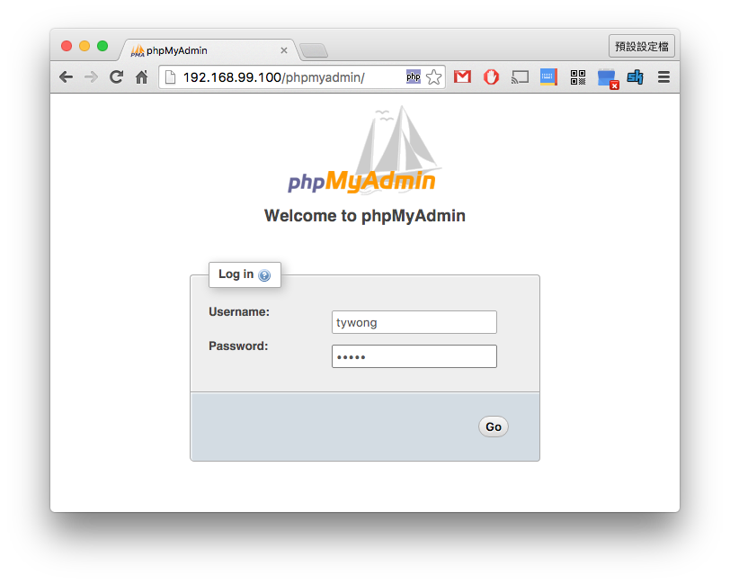
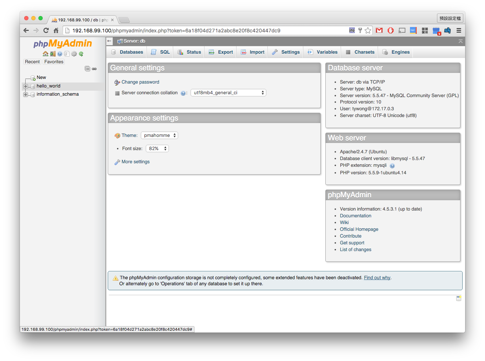
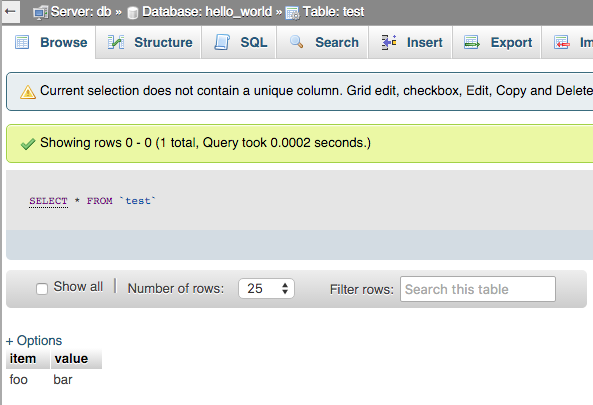

# Task 3: Link Multiple Docker Containers

## Command List

- `docker run` with the `--link` flag

## Instructions

We now have two containers: one web server and one MySQL database. We want to build a web application that has the following architecture:

So far we only work on one container. How can we link multiple containers, namely the web server and MySQL database, together?

Without Docker, we use network ports to connect multiple services together. While it is also possible to this in Docker, it is troublesome and error-prone. In fact, Docker provides a convenient **linking system** to link multiple containers together.

1. Start your MySQL container using the following command (which is from the previous task):

		docker run --name [YOUR_MYSQL_CONTAINER_NAME] -e MYSQL_ROOT_PASSWORD=[YOUR_ROOT_PASSWORD] -e MYSQL_DATABASE=[YOUR_DATABASE_NAME] -e MYSQL_USER=[YOUR_USERNAME] -e MYSQL_PASSWORD=[YOUR_PASSWORD] -d mysql:5.5

	We will use the container name (`[YOUR_MYSQL_CONTAINER_NAME]`) to link this container to the web server container.

2. I prepared a new Docker image as the web server. Type

		docker pull mtyiu/csci4140-asg1-web-base

	to get this image.

	This image is based on the previous Docker Lab, with some additional packages installed:

	- **phpMyAdmin**: View your MySQL in web interface
	- **php**: For running phpMyAdmin
	- **MySQLdb**: A Python package that lets you communicate with MySQL databases

	The configuration is also adjusted which may fix some permission denied errors when you mount a volume to the container.

3. Start the container by

		docker run -d -p 80:80 --name [WEB_SERVER_CONTAINER_NAME] --link [YOUR_MYSQL_CONTAINER_NAME]:db -e PMA_HOST=db -v ${HOME}/docker-dev:/var/www/html mtyiu/csci4140-asg1-web-base

	Do you notice that we have a new flag `--link`? This is for specifying how to link multiple containers together. Its format is:

		--link [CONTAINER_NAME_THAT_YOU_WANT_TO_LINK_TO]:[ALIAS]

	`[ALIAS]` is the name you use to connect with the MySQL container in the web server container. In other words, you use the `[ALIAS]` as the database host name to connect to the database in your CGI programs.

	**Important.** The order of starting the containers are important! You must start the MySQL container first, then the web server container such that the web server container can be linked to the MySQL database.

4. Check if both the MySQL and web server containers are up using `docker ps`.

5. It is time to check if your set-up is correct using phpMyAdmin. Use your browser to visit the web server, e.g., `http://192.168.99.100/phpmyadmin`. Log in using either the `root` account or the account you created when you start the MySQL database (i.e., `[YOUR_USERNAME]`).

	

6. You should be able to find the database you created (in this example I created the database `hello_world`).

	

7. Copy the following CGI script to the directory `cgi-bin` to see if we can access the database from the CGI script:

		#!/usr/bin/env python

		import MySQLdb

		print 'Content-type: text/plain\n'

		conn = MySQLdb.connect(
			host = 'db',
			user = 'tywong',
			passwd = 'sosad',
			db = 'hello_world'
		)
		cursor = conn.cursor()
		cursor.execute( 'CREATE TABLE IF NOT EXISTS test (item VARCHAR(32), value VARCHAR(255))' )
		cursor.execute( 'INSERT INTO test VALUES("foo", "bar")' )
		conn.commit()

		print 'Database updated!'

	*Note:* Please update the `user`, `passwd` and `db` according to your configuration.

	Go to your database in phpMyAdmin, you should see a new table called `test`, with an entry here:

	

8. **Tips for debugging.** If you get an "Internal Server Error", you can find the server log by first logging into the shell of the web server using

		docker exec -it [WEB_SERVER_CONTAINER_NAME] /bin/bash

	Then read the file `/var/log/apache2/error.log`

	

---

Prepared by [Matt YIU Man Tung](http://mtyiu.github.io/)
